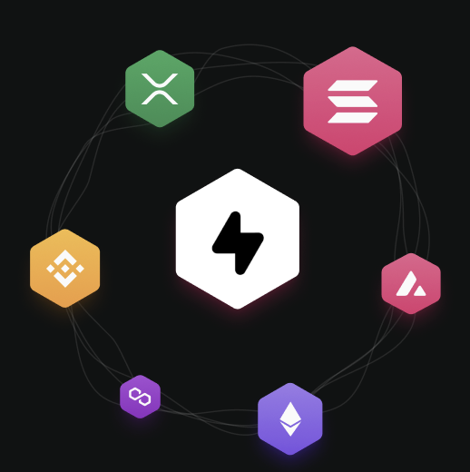

# 🚀 Sleek – Subscription Management With Blockchain Rewards.

<div align="center">
  
  <br/>
  <p><strong>All your subscriptions under one roof with GREAT discounts!</strong></p>
  
  [](https://reactnative.dev/)
  [](https://expo.dev/)
  [](https://solana.com/)
  [](https://www.anchor-lang.com/)
  [](https://www.typescriptlang.org/)
</div>

---

## 📱 Overview

Sleek is a revolutionary mobile application that combines subscription management with Solana blockchain rewards. Users can browse, purchase, and manage subscriptions while earning $BONK cashback rewards and receiving subscription NFTs.

### ✨ Key Features

- **📱 Modern Mobile UI** - Beautiful React Native interface with dark theme
- **💳 Smart Contract Payments** - Direct SOL payments for subscriptions
- **🪙 $BONK Cashback Rewards** - Earn 10% BONK tokens on every purchase
- **🪪 Subscription NFTs** - Unique NFTs for each active subscription
- **👛 Wallet Integration** - Seamless Solana wallet connection
- **📊 Real-time Analytics** - Track subscriptions, rewards, and spending
- **🎯 Category-based Browsing** - 300+ brands across 10+ categories

---

## 🏗️ Architecture

### Frontend Stack
- **React Native** - Cross-platform mobile development
- **Expo** - Development platform and build tools
- **TypeScript** - Type-safe development
- **NativeWind** - Tailwind CSS for React Native
- **Expo Router** - File-based navigation

### Blockchain Stack
- **Solana** - High-performance blockchain
- **Anchor** - Rust-based smart contract framework
- **SPL Tokens** - BONK token integration
- **Metaplex** - NFT metadata standards

### Smart Contracts
- **`subscription_payment`** - SOL payment processing
- **`bonk_rewards`** - BONK cashback minting/redemption
- **`subscription_nft`** - NFT creation and management

---


## 📱 App Screenshots

### Home Dashboard


*Browse categories and discover subscriptions*

### Subscription Management


*View active subscriptions and manage renewals*

### Rewards Center


*Track BONK cashback and redeem rewards*

### Account Settings


*Wallet connection and user preferences*

---

## 📊 Project Structure

```
Sleek-v1/
├── app/                          # Expo Router screens
│   ├── tabs/                     # Tab navigation
│   │   ├── home.tsx             # Home dashboard
│   │   ├── sleek.tsx            # Subscription management
│   │   ├── rewards.tsx          # Rewards center
│   │   └── account.tsx          # Account settings
│   ├── index.tsx                # Welcome screen
│   └── onboarding-screen.tsx    # Onboarding flow
├── src/
│   ├── components/              # Reusable components
│   │   ├── ModernTabBar.tsx    # Custom tab bar
│   │   ├── PaymentSuccessModal.tsx
│   │   └── CashbackRedeemModal.tsx
│   ├── hooks/                   # Custom React hooks
│   │   ├── useWallet.ts        # Wallet integration
│   │   └── useSubscriptionPayment.ts
│   ├── services/                # Business logic
│   │   ├── subscriptionService.ts
│   │   ├── cashbackService.ts
│   │   └── walletService.ts
│   ├── types/                   # TypeScript definitions
│   └── idl/                     # Smart contract interfaces
│       └── sleek.ts
├── programs/                    # Smart contracts
│   └── sleek/
│       ├── src/
│       │   ├── lib.rs          # Main program
│       │   ├── subscription_payment.rs
│       │   ├── bonk_rewards.rs
│       │   └── subscription_nft.rs
│       └── Cargo.toml
├── scripts/                     # Deployment scripts
│   └── deploy.ts
├── assets/                      # Images and fonts
└── android/                     # Android configuration
```

---

## 🎯 Features

### 💳 Subscription Management
- **Browse Categories** - 10+ categories with 300+ brands
- **Smart Pricing** - Real-time SOL and USD pricing
- **One-Click Purchase** - Seamless payment processing
- **Subscription Tracking** - Monitor expiry dates and renewals

### 🪙 BONK Rewards System
- **Automatic Cashback** - 10% BONK rewards on every purchase
- **Reward Tracking** - Real-time balance and transaction history
- **Redemption** - Convert BONK to SOL or other tokens
- **Referral Bonuses** - Earn extra rewards for referrals

### 🪪 NFT Subscriptions
- **Unique NFTs** - Each subscription creates a unique NFT
- **Metadata Rich** - Subscription details embedded in NFT
- **Expiry Tracking** - Visual indicators for subscription status

### 👛 Wallet Integration
- **Multi-Wallet Support** - Phantom, Solflare, and more
- **Email Onboarding Support** - Privy
- **Secure Connection** - Encrypted wallet communication
- **Balance Tracking** - Real-time SOL and token balances
- **Transaction History** - Complete payment and reward history


---

## 📄 License

This project is licensed under the MIT License - see the [LICENSE](LICENSE) file for details.

---

## 🙏 Acknowledgments

- **Solana Foundation** - For the amazing blockchain platform
- **Anchor Team** - For the excellent smart contract framework
- **Expo Team** - For the incredible React Native development platform
- **BONK Community** - For the vibrant token ecosystem

---

### Community Links
- [GitHub Repository](https://github.com/0xdaivik/Sleek-app)
- [Twitter](https://x.com/justsleekit)

---

<div align="center">
  <p><strong>Built with ❤️ using React Native, Expo, and Solana</strong></p>
  <p><em>Sleek - Where subscriptions meet blockchain rewards</em></p>
</div>
